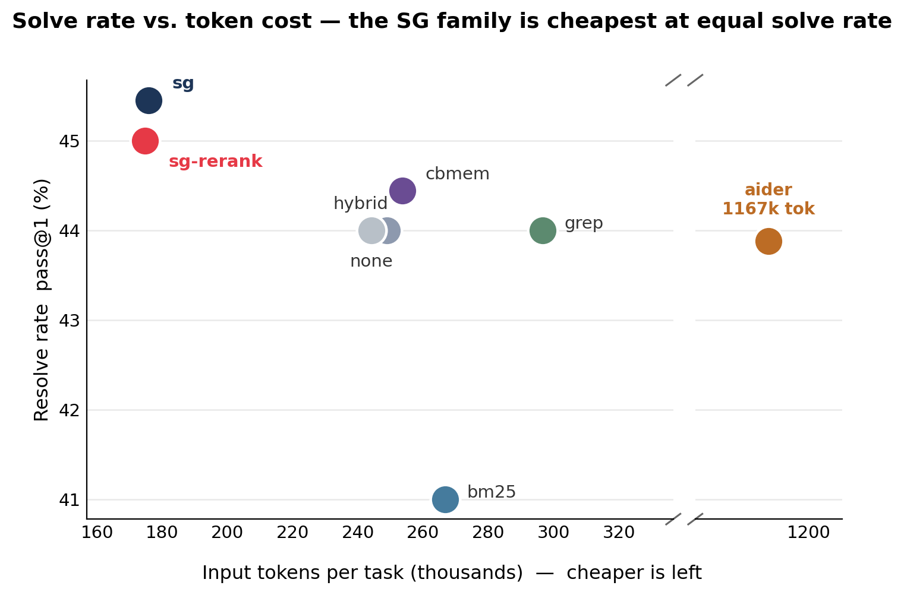

# SkeletonGraph

**A zero-LLM, tree-sitter structural index that reranks cheap lexical retrieval
and fetches one function at a time — for AI coding agents.**

SkeletonGraph (SG) indexes a codebase into function-level structure, a cross-file
call graph, and PageRank centrality — **with no LLM**. At query time it resolves the
symbols an issue names, expands the call graph, and reranks a BM25 recall pool so the
agent lands the **right function** instead of burning turns reading files. Its
companion operating point, **`sg-rerank`** (the product default), takes BM25's wide
recall pool and reorders it by structural confirmation — best file *and* function
recall of any method we tested, at the lowest token cost.

The thesis: code-context tools have been validated as a **token-optimization** game
(token-count math). We re-center on **retrieval quality** — landing the correct
function — of which lower token cost is a *consequence*, visible only end-to-end
inside the agent loop.

## Results (SWE-bench Verified, nemotron-120B, 100 tasks)



| arm | pass@1 | file recall | function recall@10 | tokens (k) | $ |
|---|--:|--:|--:|--:|--:|
| **`sg`** (lean core) | **45.5** | .854 | .319 | **176** | .051 |
| **`sg-rerank`** (method) | 45.0 | **.924** | **.404** | **175** | .051 |
| `cbmem` (zero-LLM graph) | 44.4 | .746 | .228 | 254 | .072 |
| `grep` | 44.0 | .883 | — | 297 | .084 |
| `none` (no retrieval) | 44.0 | — | — | 244 | .070 |
| `aider` (repo-map) | 43.9 | — | — | 1,167 | .319 |
| `bm25` | 41.0 | .846 | .342 | 267 | .076 |

**Findings:** (1) on contaminated benchmarks **solve rate is retrieval-insensitive**
(`none` = 44%, no arm significantly better) — so tokens and function recall are the
honest axes; (2) **file recall ≠ function recall** — most arms find the file, not the
function; (3) the **`sg` family is cheapest** while `sg-rerank` has the **best retrieval
quality**, with **no LLM** in its index.

SkeletonGraph is wrapper-first: it returns a full context packet or exposes a
retrieval index (AST skeletons + call graph + local summaries + optional embeddings)
so the IDE agent or CLI can choose targets.

SkeletonGraph has two product surfaces:

- **SG IDE**: MCP context server for Cursor, Claude Code, Copilot, Codex,
  Antigravity, Windsurf, and other agentic IDEs.
- **SG CLI**: terminal pipeline for route, prepare, dry-run, provider execution,
  and cost-aware model selection.

## Why SkeletonGraph

Most coding agents spend expensive turns discovering the repo:

```text
search -> read file -> read neighbor -> read tests -> realize the target
```

SkeletonGraph moves that work into a deterministic graph pipeline:

```text
prompt -> (optional) retrieval planner -> classify task -> find target nodes -> expand graph -> assemble packet
```

The goal is not only lower token cost. The useful product outcomes are:

- fewer exploratory file reads
- faster first useful answer
- better target/test/blast-radius context
- transparent routing reasons
- lower model overkill for routine tasks
- reusable packets for IDEs, CLIs, and other agents

## Install

```bash
pip install skeletongraph
```

For provider-backed CLI execution:

```bash
pip install "skeletongraph[llm]"
```

## Quick Start: SG IDE

Use this path when you already work inside Cursor, Claude Code, Copilot, Codex,
Antigravity, or another MCP-capable coding environment.

```bash
cd your-project
sg init
sg build
sg doctor
```

`sg init` writes the MCP config and the agent instruction file for the selected
IDE. SG IDE does not require an API key. Your IDE subscription/model still does
the reasoning and editing; SkeletonGraph supplies the packet or retrieval
signals for efficient target selection.

Supported IDE setup targets include:

| IDE | Integration | Model switching |
| --- | --- | --- |
| Cursor | MCP + rules | manual in IDE |
| Claude Code | MCP + `CLAUDE.md` | `/model` command |
| GitHub Copilot | MCP + instructions | manual in IDE |
| Codex | MCP + `AGENTS.md` | manual in agent |
| Antigravity | MCP + rules | manual in IDE |
| Windsurf | MCP + rules | manual in IDE |

## Quick Start: SG CLI

Use this path when you want a terminal-first context and model-routing pipeline.

```bash
cd your-project
sg build
sg route "fix the auth token validation bug"
sg prepare "fix the auth token validation bug" --out .skeletongraph/context.md
sg run "fix the auth token validation bug" --dry-run
```

`sg route`, `sg prepare`, and `sg run --dry-run` do not need an API key.

To call a provider:

```bash
sg config --cli-provider anthropic
$env:ANTHROPIC_API_KEY = "..."
sg run "fix the auth token validation bug" --execute
```

To test locally without a paid provider key:

```bash
ollama pull qwen3-coder:latest
ollama serve
sg config --cli-provider local
sg run "fix the auth token validation bug" --dry-run
sg run "fix the auth token validation bug" --execute
```

Local execution is intended for cheap pipeline testing. Use provider models for
quality benchmarks unless the benchmark is specifically for local models.

## Model Routing

SkeletonGraph separates IDE-facing model labels from CLI provider model names.

For IDEs, model tiers are recommendations:

| Tier | Typical use |
| --- | --- |
| SLM | docs, explanations, simple lookup |
| MLM | normal coding, debugging, tests, review |
| LLM | architecture, broad migrations, low-confidence tasks |

For CLI execution, SkeletonGraph can route to provider model names:

```bash
sg config --cli-provider anthropic
sg config --cli-provider openai
sg config --cli-provider google
sg config --cli-provider local
```

Dynamic routing uses task mode, confidence, candidate count, token size, and
complexity. Code-changing work keeps an MLM floor by default so cost savings do
not come from making weak models edit code unsafely. Retrieval planning can use
small models to propose targets over AST/summaries before the heavy model runs.

## IDE Integration

After `sg init` and `sg build`, register SG as an MCP server and write IDE hooks:

```bash
sg install --ide claude-code   # Claude Code: hooks + MCP server + CLAUDE.md rules
sg install --ide cursor        # Cursor: MCP + .cursor/rules/skeletongraph.mdc + hooks
sg install --ide cline         # Cline / Roo: MCP config + rules block
sg install --ide copilot       # GitHub Copilot: MCP + copilot-instructions.md
sg install --ide windsurf      # Windsurf: MCP + .windsurfrules
sg install                     # auto-detect all installed IDEs
```

After install, restart your editor. SkeletonGraph runs as a background MCP server
(`sg serve --path .`) that the IDE connects to automatically.

## MCP Tools

Six tools are exposed to the IDE agent. Use these **instead of** grep/glob/file reads:

| Tool | When to call | Returns |
| --- | --- | --- |
| `sg_overview` | Session start — once per session | Constraints + top-N functions (by PageRank) + recent turns + index stats |
| `sg_search "query"` | **Primary retrieval** — almost every prompt | Top-3 matches with body excerpts + summaries + 1-hop callers; top-4..N as signatures + summaries. One call usually enough — no need to chain. |
| `sg_get "fqn"` | When the exact FQN is known | Signature + summary + 1-hop callers + callees |
| `sg_expand "target"` | When more body is needed than `sg_search` returned | Full function body / file / line range (token-capped) |
| `sg_constraint list` / `propose` | Before proposing changes | Confirmed + proposed project rules |
| `sg_log` | Reviewing recent session turns | Last-N turn summaries with files touched |

**Smart context routing.** On each `UserPromptSubmit`, SG classifies the prompt
(architecture / explain / decision / debug / test / review / general) and
includes the matching MD file from `.skeletongraph/` — e.g. `architecture.md`
only for design/refactor queries, `project.md` only for "what is this codebase"
queries. Constraints + session digest + relevant functions are always injected.

**Cold start.** If no `.skeletongraph/` index exists when an MCP tool is called,
SG auto-builds on first invocation (see `auto_build_on_query` in config).

## CLI Reference

**Indexing & status**

| Command | Purpose |
| --- | --- |
| `sg init [--agent cursor]` | Configure project, IDE preset, MCP, constraints |
| `sg index` | Full index (alias for `sg build`) |
| `sg index --incremental` | Only re-index changed files |
| `sg build` | Full index with detailed output |
| `sg update` | Incremental update |
| `sg status` | Show index status |
| `sg doctor` | Check index, routing, provider, Ollama readiness |
| `sg overview` | Project skeleton: top functions, constraints, session |
| `sg install [--ide <name>]` | Write IDE hooks + MCP config |

**Retrieval**

| Command | Purpose |
| --- | --- |
| `sg search "query"` | BM25 + graph search (no API key) |
| `sg get "fqn"` | Get function signature, summary, callers |
| `sg expand "target"` | Expand function body / file / line range |

**Constraints & session**

| Command | Purpose |
| --- | --- |
| `sg constraint list` | List all constraints |
| `sg constraint propose "text"` | Add a proposal |
| `sg constraint confirm <id>` | Promote proposal → decisions.md |
| `sg constraint remove <id>` | Remove a constraint |
| `sg constraint aggregate` | Import from IDE rule files |
| `sg log [--last-n 10]` | Show recent session turns |

**Summarization**

| Command | Purpose | API key |
| --- | --- | --- |
| `sg summarize --tier local` | Ollama Tier-0.5 (free, on-device) | no |
| `sg summarize --tier cloud` | Cloud LLM Tier-1 | provider key |
| `sg summarize --tier cloud --force` | Re-summarize all functions | provider key |

**Model routing & execution**

| Command | Purpose | API key |
| --- | --- | --- |
| `sg route "task"` | Show task mode, tier, recommended model | no |
| `sg run "task" --dry-run` | Plan routed execution | no |
| `sg run "task" --execute` | Call configured provider | provider or local |
| `sg config [--agent cursor]` | Configure IDE and CLI models | no |
| `sg config --cli-provider anthropic` | Set CLI execution provider | no |

**Background indexing**

| Command | Purpose |
| --- | --- |
| `sg watch` | Daemon: auto-reindex files on save |

Provider output from `sg run --execute` is written to `.skeletongraph/runs/`.
Evaluation is currently done externally via SWE-bench harness — see `docs/swe_bench_runbook.md`.

## Python API

```python
from skeletongraph.engine import SGEngine

engine = SGEngine(project_root=".")
result = engine.query("fix the content-length bug", delivery="cli")

print(result.context_text)
print(result.query_mode)
print(result.model_tier)
print(result.recommended_model)
print(result.routing_reason)
```

## Architecture

```text
src/skeletongraph/
  parser/       AST extraction
  graph/        dependency graph and ranking
  storage/      .skeletongraph persistence
  retrieval/    classification, resolution, model routing
  assembly/     context packet construction
  session/      memory and dedup
  server/       MCP server
  llm/          LiteLLM wrapper for optional CLI execution
  cli/          Click commands
  engine.py     unified query pipeline
```

## Evaluation

The architecture/pipeline blueprint and evaluation plan are in:

```text
docs/blueprint.md
docs/evaluation.md
```

SkeletonGraph should be evaluated on both quality and cost:

- target recall and packet completeness
- missed tests/callers
- first useful answer latency
- file reads after SG context
- pass rate
- cost per passing task
- dynamic routing overkill/underpower rate
- IDE compliance with SG-first context usage

Cost savings are only meaningful when reported with pass rate.

## Install

```bash
pip install skeletongraph           # core: indexing, MCP server, CLI (no API key needed)
pip install "skeletongraph[llm]"    # + litellm for sg run --execute / sg summarize --tier cloud
pip install "skeletongraph[all]"    # everything
```

## License

MIT
