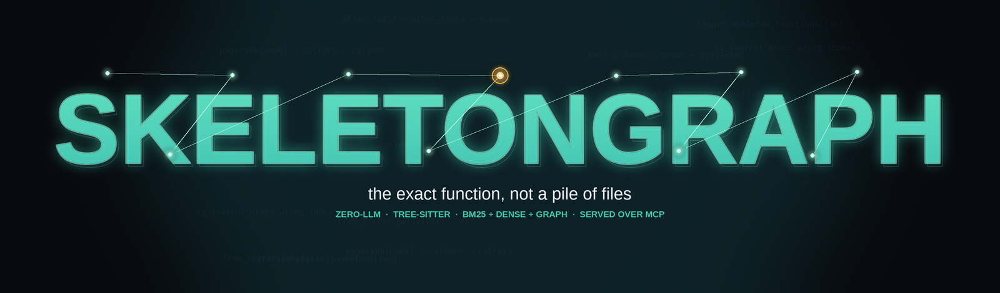
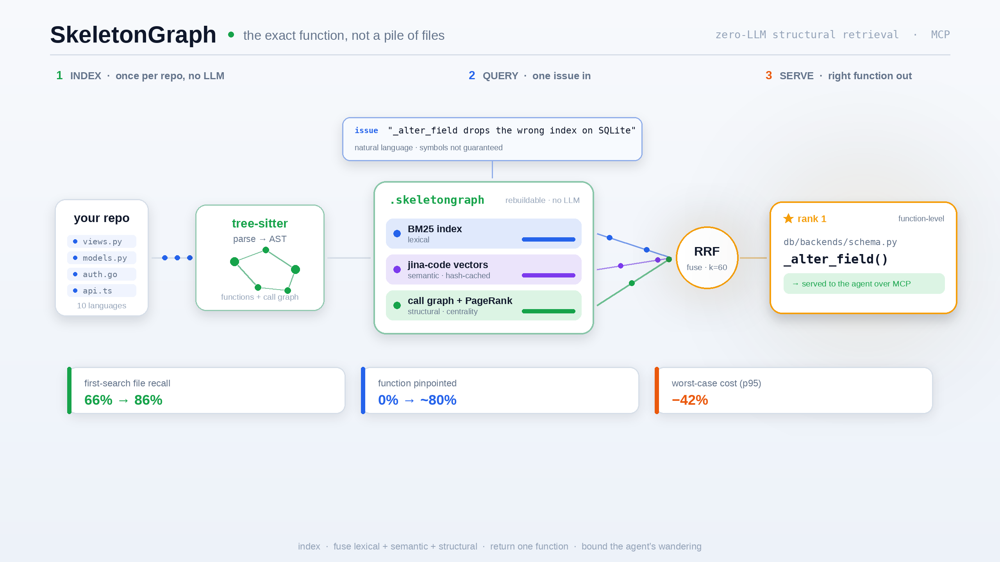
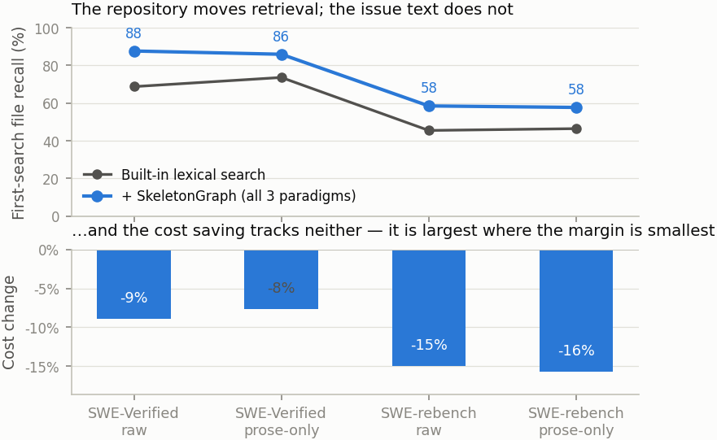

<!-- mcp-name: io.github.yashdoke7/skeletongraph -->
<p align="center">
  
</p>

# SkeletonGraph

<p align="center">
  <a href="https://pypi.org/project/skeletongraph/"></a>
  <a href="https://pypi.org/project/skeletongraph/"></a>
  <a href="LICENSE"></a>
  <a href="https://modelcontextprotocol.io"></a>
  
</p>

<p align="center">
  <strong>Works with</strong>&nbsp;
  
  
  
  
  
  
  
  
</p>

<p align="center">
  <strong>Languages</strong>&nbsp;
  
  
  
  
  
  
  
  
  
  
</p>

**Coding agents burn tokens reading whole files to find one function. SkeletonGraph
indexes your repo with tree-sitter — no LLM — and hands the agent the exact function
to edit, over MCP.**

<picture>
  <source srcset="docs/paper/figures/skeletongraph_hero.gif" media="(prefers-reduced-motion: no-preference)">
  
</picture>

<p align="center"><em>Index once (no LLM) → fuse lexical + semantic + structural signals → return the exact function, served to your agent over MCP.</em></p>

SkeletonGraph is a retrieval engine purpose-built for coding agents, not a general
RAG library retrofitted onto code. It parses a repository into function-level
structure, a cross-file call graph, and PageRank centrality with **zero LLM calls** —
deterministic, cheap, and instant to rebuild after every edit. At query time it
resolves the symbols an issue names, walks the call graph outward, and reranks a
BM25 recall pool by structural confirmation so the agent lands on the **right
function** on the first try, instead of grepping and re-reading its way there. Its
leaner operating point, **`sg-rerank`** (the product default), skips the dense leg
entirely and still delivers the best file *and* function recall of any method we
benchmarked it against — at the lowest token cost of any of them.

The thesis: code-context tools have mostly been validated as a **token-optimization**
game — how few tokens can you spend. SkeletonGraph re-centers the question on
**retrieval quality** — did the agent land on the correct function — of which lower
token cost turns out to be a *consequence*, measurable only end-to-end inside a real
agent loop, not in an offline benchmark.

## Results

All numbers below are regenerated from the released run artifacts
(`python -m eval.scripts.make_paper_figures`). The full verified ledger, including
withdrawn claims, is in [`docs/paper/FINDINGS.md`](docs/paper/FINDINGS.md).

### 1. Controlled retrieval ablation (react loop, open-weight model, 100 tasks)

Identical action space for every arm; **only the retrieval backend changes**. The
`none` arm gets no code access at all and establishes the memorization floor.

| arm | pass@1 | file recall@1 | function hit | tokens (k) | turns | $/task |
|---|--:|--:|--:|--:|--:|--:|
| **`sg-fusion`** | **42.0%** | .737 | **57%** | **180** | 21.9 | **.052** |
| `bm25` | 41.0% | .642 | 43% | 264 | 24.6 | .074 |
| `graphify` (knowledge graph) | 41.0% | .223 | 9% | 275 | 25.6 | .078 |
| `grep` | 39.0% | .647 | 0% | 282 | 22.4 | .079 |
| `aider` (repo-map) | 36.7% | — | — | 1,126 | 18.1 | .160 |
| `none` (no retrieval) | 35.0% | — | — | 345 | 23.6 | .066 |

**`sg-fusion` is the top arm, the cheapest arm, and the only one that localizes to
the function** (57% vs grep's 0% — lexical search is file-granular by construction).
Against the closed-book floor of 35.0%, retrieval is worth **+7 points** here.

`sg-rerank`'s recall/cost profile is reported separately in the agent-free intrinsic
retrieval ablation in [`docs/paper/skeletongraph.tex`](docs/paper/skeletongraph.tex)
(Table 2, §5.1) — best MRR/recall@10 short of full fusion, at the lowest index cost.

### 2. Deployment: SkeletonGraph vs native Claude Code (MCP, Docker-verified)

The product itself — SG as an MCP server driving **Claude Code (sonnet)** against
Claude Code on its own tools. 100 paired SWE-bench Verified tasks:

| arm | pass@1 | file recall@1 | turns | $/task |
|---|--:|--:|--:|--:|
| `native` (Claude's own Grep/Read) | 74/100 | .663 | 14.5 | .434 |
| **`sg-fusion`** (SkeletonGraph MCP) | 75/100 | **.836** | **11.4** | **.371** |

**Equivalent solve rate at −14.6% cost and −21.4% turns.** The saving is not spread
evenly — it lives almost entirely in the tail:

| cost percentile | native | +SG | change |
|---|--:|--:|--:|
| 50th (median task) | $0.255 | $0.260 | **+1.9%** |
| 90th | $1.010 | $0.752 | −25.6% |
| 95th (worst tasks) | $1.559 | $0.896 | **−42.5%** |

Retrieval does nothing for the typical task and removes over 40% of the cost of the
worst ones. Paired bootstrap 95% CI on the mean: [−25.3%, −1.2%]; McNemar on pass@1:
p = 1.0 (no difference).

### 3. The ceiling: what structural retrieval cannot do



`sg-fusion` runs all three non-LLM retrieval paradigms at once — lexical (BM25),
semantic (code embeddings), and topological (call graph). Crossing *memorization*
(standard vs. decontaminated benchmark) against *location cues* (original vs.
prose-stripped issue text) shows the limit:

| condition | cost | file recall native → SG |
|---|--:|--:|
| SWE-Verified, raw | −32.2% | .661 → .861 |
| SWE-Verified, **prose-only** | −21.1% | .717 → .711 (**no edge**) |
| SWE-rebench (unseen repos), raw | −26.4% | .500 → .639 |
| SWE-rebench, **prose-only** | −31.3% | .394 → .439 |

Two things happen at once. **The retrieval advantage collapses** — on prose-only
issues it disappears entirely — and the lexical baseline falls in parallel, so this
is a property of the whole category, not of one implementation. **Yet the cost saving
persists in every condition**, including the one where retrieval quality is identical
to the baseline. Retrieval quality is therefore *not* the mechanism producing the
saving; bounding how far the agent wanders before it commits is.

> SWE-Verified rows are restricted to the same 15 tasks as the prose run so raw and
> prose are paired. That subset is *not* representative of the full 100 (SG saves
> −32.2% on it vs −14.6% overall) — do not compare it against the n=100 figure.

### 4. Deployment finding: slow MCP servers are structurally excluded

Two graph/LSP-based competitors wired as MCP servers **never participated at all**.
Claude Code's headless (`-p`) mode finalizes its tool manifest within ~2 seconds of
launch and never updates it; servers needing real bootstrap time (a language server,
a Node CLI + index) finish their handshake just past that window and are silently
absent for the entire run — confirmed via session-init transcripts and each server's
own logs showing it was ready seconds later.

This is a **deployment-mode result, not a retrieval-quality one**, and we report no
performance comparison for those systems: with zero tool calls, any such number would
measure their absence rather than their retrieval. A separately wired zero-LLM graph
competitor connected cleanly with all 14 tools visible, yet the agent never invoked
one across 10 tasks, defaulting to native `grep` every time. Fast connection and
actual adoption are prerequisites that retrieval quality cannot substitute for.

SkeletonGraph is wrapper-first: it returns a full context packet or exposes a
retrieval index (AST skeletons + call graph + local summaries + optional embeddings)
so the IDE agent or CLI can choose targets.

SkeletonGraph has two product surfaces:

- **SG IDE**: MCP context server for Cursor, Claude Code, Copilot, Codex,
  Antigravity, Windsurf, and other agentic IDEs.
- **SG CLI**: terminal pipeline for route, prepare, dry-run, provider execution,
  and cost-aware model selection.

## Why SkeletonGraph

Most coding agents spend expensive turns discovering the repo:

```text
search -> read file -> read neighbor -> read tests -> realize the target
```

SkeletonGraph moves that work into a deterministic graph pipeline:

```text
prompt -> (optional) retrieval planner -> classify task -> find target nodes -> expand graph -> assemble packet
```

The goal is not only lower token cost. The useful product outcomes are:

- fewer exploratory file reads
- faster first useful answer
- better target/test/blast-radius context
- transparent routing reasons
- lower model overkill for routine tasks
- reusable packets for IDEs, CLIs, and other agents

## Install

```bash
pip install skeletongraph           # core: indexing, MCP server, CLI (no API key needed)
pip install "skeletongraph[llm]"    # + litellm for sg run --execute / sg summarize --tier cloud
pip install "skeletongraph[all]"    # everything
```

## Quick Start: SG IDE

Use this path when you already work inside Cursor, Claude Code, Copilot, Codex,
Antigravity, or another MCP-capable coding environment.

```bash
cd your-project
sg init
sg build
sg doctor
```

`sg init` writes the MCP config and the agent instruction file for the selected
IDE. SG IDE does not require an API key. Your IDE subscription/model still does
the reasoning and editing; SkeletonGraph supplies the packet or retrieval
signals for efficient target selection.

Supported IDE setup targets include:

| IDE | Integration | Model switching |
| --- | --- | --- |
| Cursor | MCP + rules | manual in IDE |
| Claude Code | MCP + `CLAUDE.md` | `/model` command |
| GitHub Copilot | MCP + instructions | manual in IDE |
| Codex | MCP + `AGENTS.md` | manual in agent |
| Antigravity | MCP + rules | manual in IDE |
| Windsurf | MCP + rules | manual in IDE |

## Quick Start: SG CLI

Use this path when you want a terminal-first context and model-routing pipeline.

```bash
cd your-project
sg build
sg route "fix the auth token validation bug"
sg prepare "fix the auth token validation bug" --out .skeletongraph/context.md
sg run "fix the auth token validation bug" --dry-run
```

`sg route`, `sg prepare`, and `sg run --dry-run` do not need an API key.

To call a provider:

```bash
sg config --cli-provider anthropic
$env:ANTHROPIC_API_KEY = "..."
sg run "fix the auth token validation bug" --execute
```

To test locally without a paid provider key:

```bash
ollama pull qwen3-coder:latest
ollama serve
sg config --cli-provider local
sg run "fix the auth token validation bug" --dry-run
sg run "fix the auth token validation bug" --execute
```

Local execution is intended for cheap pipeline testing. Use provider models for
quality benchmarks unless the benchmark is specifically for local models.

## Model Dependency, Prewarming, and Keeping the Index Fresh

SG downloads **two** small embedding models on first use, both via
`sentence-transformers` (a hard dependency, not optional):

- **`jinaai/jina-embeddings-v2-base-code`** (`SG_DENSE_MODEL`) — the semantic
  leg of `fusion`/`sg_search`. Loaded on `sg warm` or on an agent's first
  dense-retrieval query. Loads with `trust_remote_code=True` (Jina ships custom
  modeling code on the HF Hub) — this executes code from that model repo, same
  as any `trust_remote_code` model.
- **`all-MiniLM-L6-v2`** (`SG_EMBED_MODEL`) — a smaller, separate model used
  only as a confidence-score tiebreaker at index time. Downloads automatically
  on the **first `sg build`**, not on `sg warm`.

Both need internet access the very first time each is used on a machine — after
that, both are cached locally (Hugging Face's model cache, plus SG's own
content-hash caches: `.skeletongraph/dense_cache` for the dense leg,
`.skeletongraph/embeddings.npz` for the confidence tiebreaker) — so later builds
are incremental: only functions whose text actually changed get re-embedded.

**Prewarm before launching an agent**, so that cost lands during setup instead
of on the agent's first real search:

```bash
sg build                 # parse + structural index (no LLM, fast)
sg warm --path .          # prebuild BM25 + dense caches (one-time; minutes on CPU)
sg warm --path . --mode rerank   # skip the dense leg entirely (no embedding cost)
```

Without this, the first `sg_search` call an agent makes pays the cold-encode
cost inline — on a large repo this can exceed the dense retrieval leg's
internal timeout (`SG_DENSE_TIMEOUT_S`, 20s by default), in which case it
silently degrades to a 2-signal (lexical + structural) result rather than
failing outright. Prewarming avoids relying on that fallback altogether.

**Keeping the index current as files change** — two options, pick based on
how you work:

```bash
sg update --path .        # one-shot: re-index only files that changed since last build
sg watch --path .         # background daemon: auto-reindexes on save (needs `pip install "skeletongraph[daemon]"`)
```

`sg watch` is the hands-off option for active development — it debounces
rapid saves and calls the same incremental update path as `sg update`, so
editing a file is reflected in the index without a manual rebuild.

## Model Routing

SkeletonGraph separates IDE-facing model labels from CLI provider model names.

For IDEs, model tiers are recommendations:

| Tier | Typical use |
| --- | --- |
| SLM | docs, explanations, simple lookup |
| MLM | normal coding, debugging, tests, review |
| LLM | architecture, broad migrations, low-confidence tasks |

For CLI execution, SkeletonGraph can route to provider model names:

```bash
sg config --cli-provider anthropic
sg config --cli-provider openai
sg config --cli-provider google
sg config --cli-provider local
```

Dynamic routing uses task mode, confidence, candidate count, token size, and
complexity. Code-changing work keeps an MLM floor by default so cost savings do
not come from making weak models edit code unsafely. Retrieval planning can use
small models to propose targets over AST/summaries before the heavy model runs.

## IDE Integration

After `sg init` and `sg build`, register SG as an MCP server and write IDE hooks:

```bash
sg install --ide claude-code   # Claude Code: hooks + MCP server + CLAUDE.md rules
sg install --ide cursor        # Cursor: MCP + .cursor/rules/skeletongraph.mdc + hooks
sg install --ide cline         # Cline / Roo: MCP config + rules block
sg install --ide copilot       # GitHub Copilot: MCP + copilot-instructions.md
sg install --ide windsurf      # Windsurf: MCP + .windsurfrules
sg install                     # auto-detect all installed IDEs
```

After install, restart your editor. SkeletonGraph runs as a background MCP server
(`sg serve --path .`) that the IDE connects to automatically.

## MCP Tools

Six tools are exposed to the IDE agent. Use these **instead of** grep/glob/file reads:

| Tool | When to call | Returns |
| --- | --- | --- |
| `sg_overview` | Session start — once per session | Constraints + top-N functions (by PageRank) + recent turns + index stats |
| `sg_search "query"` | **Primary retrieval** — almost every prompt | Top-3 matches with body excerpts + summaries + 1-hop callers; top-4..N as signatures + summaries. One call usually enough — no need to chain. |
| `sg_get "fqn"` | When the exact FQN is known | Signature + summary + 1-hop callers + callees |
| `sg_expand "target"` | When more body is needed than `sg_search` returned | Full function body / file / line range (token-capped) |
| `sg_constraint list` / `propose` | Before proposing changes | Confirmed + proposed project rules |
| `sg_log` | Reviewing recent session turns | Last-N turn summaries with files touched |

**Smart context routing.** On each `UserPromptSubmit`, SG classifies the prompt
(architecture / explain / decision / debug / test / review / general) and
includes the matching MD file from `.skeletongraph/` — e.g. `architecture.md`
only for design/refactor queries, `project.md` only for "what is this codebase"
queries. Constraints + session digest + relevant functions are always injected.

**Cold start.** If no `.skeletongraph/` index exists when an MCP tool is called,
SG auto-builds on first invocation (see `auto_build_on_query` in config).

## CLI Reference

**Indexing & status**

| Command | Purpose |
| --- | --- |
| `sg init [--agent cursor]` | Configure project, IDE preset, MCP, constraints |
| `sg index` | Full index (alias for `sg build`) |
| `sg index --incremental` | Only re-index changed files |
| `sg build` | Full index with detailed output |
| `sg update` | Incremental update |
| `sg status` | Show index status |
| `sg doctor` | Check index, routing, provider, Ollama readiness |
| `sg overview` | Project skeleton: top functions, constraints, session |
| `sg install [--ide <name>]` | Write IDE hooks + MCP config |

**Retrieval**

| Command | Purpose |
| --- | --- |
| `sg search "query"` | BM25 + graph search (no API key) |
| `sg get "fqn"` | Get function signature, summary, callers |
| `sg expand "target"` | Expand function body / file / line range |

**Constraints & session**

| Command | Purpose |
| --- | --- |
| `sg constraint list` | List all constraints |
| `sg constraint propose "text"` | Add a proposal |
| `sg constraint confirm <id>` | Promote proposal → decisions.md |
| `sg constraint remove <id>` | Remove a constraint |
| `sg constraint aggregate` | Import from IDE rule files |
| `sg log [--last-n 10]` | Show recent session turns |

**Summarization**

| Command | Purpose | API key |
| --- | --- | --- |
| `sg summarize --tier local` | Ollama Tier-0.5 (free, on-device) | no |
| `sg summarize --tier cloud` | Cloud LLM Tier-1 | provider key |
| `sg summarize --tier cloud --force` | Re-summarize all functions | provider key |

**Model routing & execution**

| Command | Purpose | API key |
| --- | --- | --- |
| `sg route "task"` | Show task mode, tier, recommended model | no |
| `sg run "task" --dry-run` | Plan routed execution | no |
| `sg run "task" --execute` | Call configured provider | provider or local |
| `sg config [--agent cursor]` | Configure IDE and CLI models | no |
| `sg config --cli-provider anthropic` | Set CLI execution provider | no |

**Background indexing**

| Command | Purpose |
| --- | --- |
| `sg watch` | Daemon: auto-reindex files on save |

Provider output from `sg run --execute` is written to `.skeletongraph/runs/`.
Evaluation is currently done externally via SWE-bench harness — see `docs/swe_bench_runbook.md`.

## Python API

```python
from skeletongraph.engine import SGEngine

engine = SGEngine(project_root=".")
result = engine.query("fix the content-length bug", delivery="cli")

print(result.context_text)
print(result.query_mode)
print(result.model_tier)
print(result.recommended_model)
print(result.routing_reason)
```

## Architecture

```text
src/skeletongraph/
  parser/       AST extraction
  graph/        dependency graph and ranking
  storage/      .skeletongraph persistence
  retrieval/    classification, resolution, model routing
  assembly/     context packet construction
  session/      memory and dedup
  server/       MCP server
  llm/          LiteLLM wrapper for optional CLI execution
  cli/          Click commands
  engine.py     unified query pipeline
```

## Evaluation

The architecture/pipeline blueprint and evaluation plan are in:

```text
docs/blueprint.md
docs/evaluation.md
```

SkeletonGraph should be evaluated on both quality and cost:

- target recall and packet completeness
- missed tests/callers
- first useful answer latency
- file reads after SG context
- pass rate
- cost per passing task
- dynamic routing overkill/underpower rate
- IDE compliance with SG-first context usage

Cost savings are only meaningful when reported with pass rate.

## License

SkeletonGraph is released under the [MIT License](LICENSE) — free to use, modify, and
distribute, for commercial and private projects alike.

## Citation

If SkeletonGraph is useful in your research, please cite:

```bibtex
@misc{doke2026skeletongraph,
  title  = {Retrieval Is Not Reasoning: The Localization Ceiling in AI Coding Agents},
  author = {Doke, Yash},
  year   = {2026},
  note   = {SkeletonGraph — zero-LLM structural retrieval for coding agents},
  url    = {https://github.com/yashdoke7/skeletongraph}
}
```
