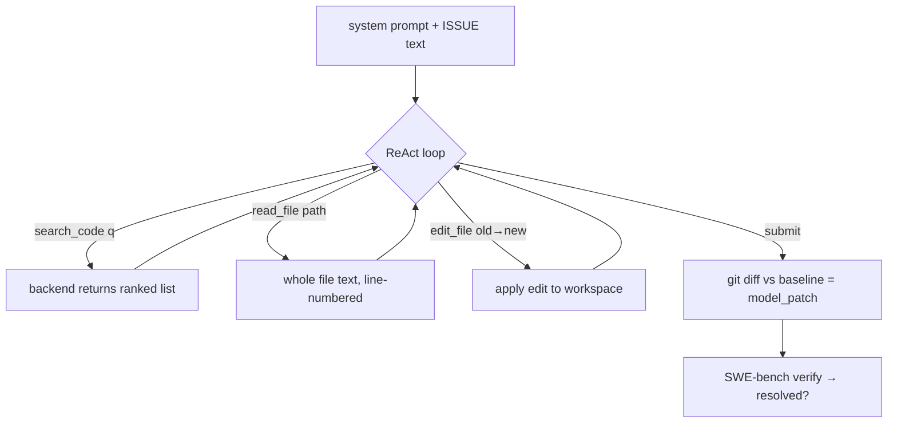
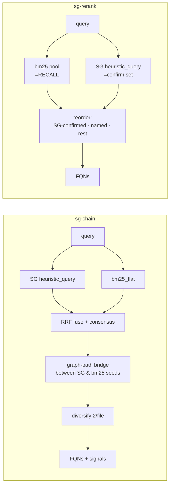

# Arm Flows — how each retrieval arm works with the agent's tools

> Reference for visualizing what every arm does in the eval loop, and the gap
> between **how we currently wrap each system** vs **how it natively works**.
> Last updated 2026-06-03.

---

## 1. The common agent loop (CURRENT design — controlled ablation)

Every arm today gets the **identical** tool set. Only `search_code`'s backend differs.

Shared tools (all arms): `search_code · list_files · read_file · edit_file · submit`.
**The agent always reads WHOLE files** (or a line range) — no per-function fetch.

---

## 2. What each arm's `search_code` returns

| Arm | backend | returns | granularity | graph? | embeddings? |
|---|---|---|---|---|---|
| `sg` | `heuristic_query` | ranked `file::symbol` | function | gated + centrality | no |
| `bm25` | `bm25_flat` | ranked `file::symbol` | function | no | no |
| `grep` | `grep_sim` | ranked file paths | file | no | no |
| `hybrid` | BM25∪dense→cross-encoder | ranked file paths | file | no | dense |
| `none` | — | `"No results."` | — | — | — |
| `summary-dense` | dense over LOCAL summaries | ranked `file::symbol` | function | no | dense(summaries) |
| `sg-chain` | SG ∪ bm25, RRF + graph-path bridge | `file::symbol` + signals | function | path-bridge | no |
| `sg-rerank` | bm25 pool reordered by SG | ranked `file::symbol` | function | confirm-only | no |
| `cbmem` | `search_graph` (**1 of 14 tools**) | file paths | file (**nerfed**) | (discarded) | no |
| `aider` | `RepoMap.get_ranked_tags` | file paths | file (**not native**) | PageRank | no |

After the ranked list, the model picks files and calls `read_file` (whole file) → reads, edits, submits.
**Retrieval metrics (recall/precision/rank) are scored on this ranked list — never on what the agent reads.**

---

## 3. The two SG+BM25 hybrids (be honest about what they are)

These are **not** "the SG pipeline" — they lean on bm25 for recall:

- **sg-chain** recall = bm25's; rank/precision = SG's. A BM25+SG **fusion**.
- **sg-rerank** recall = bm25's (pool); rank = SG's (reorder). A BM25+SG **reranker**.
- Honest label: "BM25 + SG reranking", NOT "SG". SG's *own* recall is its weak point
  (sg funcHit ~48% < bm25 ~51%); these arms borrow bm25's recall. Keep only if they
  earn pass@1, not to inflate recall.

---

## 4. The gap — native pipeline vs our wrapper (the design decision)

| System | What it NATIVELY does | What we wrap today | Gap |
|---|---|---|---|
| **SG** (MCP) | `sg_search` (structural) + **read-the-function / expand-to-callers** + 3-tier summaries → token-cheap structural context | `heuristic_query` → FQN list; agent reads **whole files** | SG's token-saving function/graph fetch is **unused** — we test SG as a bare ranker |
| **cbmem** (MCP) | **14 tools** (search_graph, trace_call_path, get_architecture, detect_changes, Cypher…) returning **pruned ~500-tok subgraphs** | `search_graph` only → **file paths** | **13/14 tools + all structured output discarded** |
| **aider** | PageRank repo-map **injected into context** (no search tool); model then requests files | turned into a file-path `search_code` tool | **misrepresents aider entirely** |
| **bm25 / grep / hybrid / none** | baselines — a ranker or nothing; no special tools | used as-is | faithful ✅ |

**Takeaway:** the controlled-ablation harness is faithful to the *baselines* (bm25/grep/none)
but **nerfs the three pipelines** (SG, cbmem, aider) down to a file/FQN ranker.

---

## 5. Two ways to run **final v2**

**A. Controlled retrieval ablation (what we have).**
Same tools, vary only the ranking. Isolates "is the *ranking* better." Clean mechanism
study, but cannot show pipeline value (SG token-fetch, cbmem subgraphs, aider injection).
→ Keep as the *secondary* "why does it work" analysis.

**B. Systems / pipeline comparison (faithful).**
Common substrate = model + tasks + `edit`/`submit`/`verify`. Each system uses its **native
tools**:
- **SG** — `sg_search` + `read_symbol` (function body) + `expand` (callers/callees).
- **cbmem** — its real MCP tools (search_graph, trace_call_path, get_architecture…) returning subgraphs.
- **aider** — repo-map **injected** into the system prompt (no search tool); request-file flow.
- **bm25 / grep / none** — baselines, unchanged (search→read whole file).

→ The honest "does the SG *pipeline* help the agent" test. Bigger build (each arm has its
own tool surface), and it confounds ranking+tools+delivery **on purpose** — that's the
system being compared.

**Proposed final-v2 arm set (lean — old ablations retired):**
`sg` (native pipeline) · `bm25` · `grep` · `hybrid` · `none` · `cbmem` (native) · `aider` (native)
— plus at most ONE clearly-labeled `bm25+sg-rerank` hybrid *iff* it earns pass@1.
